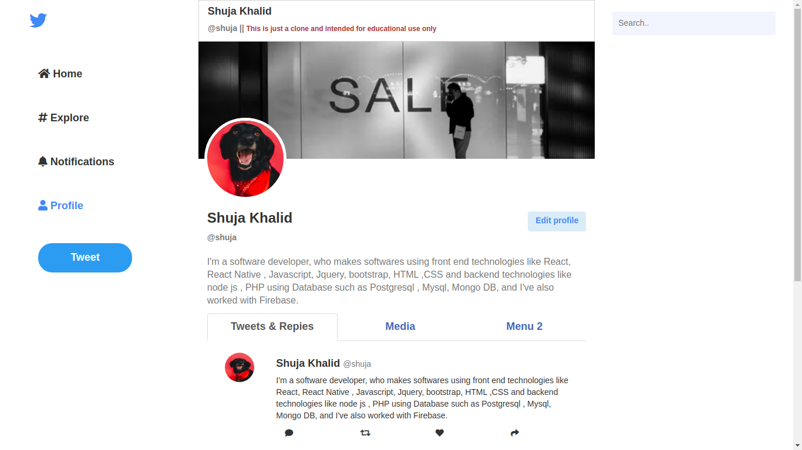
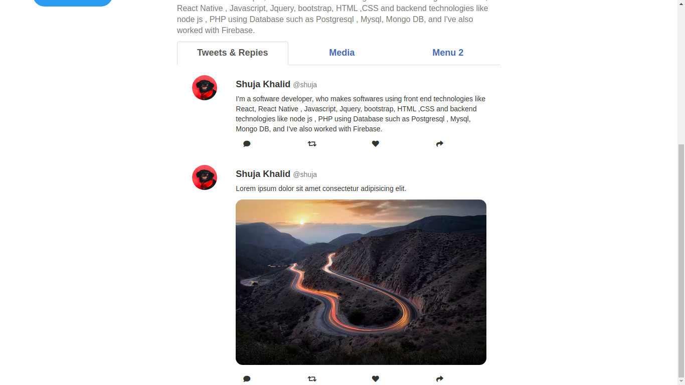

## Twitter Profile UI Clone

A simple twitter Profile UI clone built with HTML CSS Bootstrap. This example was put by me with intend to educate beginners about industry standard design rules.

### Installation

- `git clone https://github.com/shujakhalid19/twitter-clone`

### Running

- `sudo lampp start`
or simply run on your local server

---

This project was put together to serve as an example to help you in building your own Web Designs and is intended for educational use only.